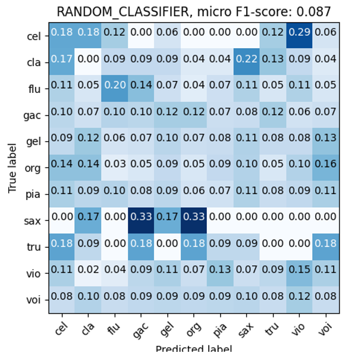

# Audio Instrument Recognition with Machine Learning

This project aims to develop a machine-learning model capable of predicting the predominant musical instrument in an audio file. The project leverages various machine learning and deep learning techniques to achieve this goal. The primary objective is to classify audio clips into one of several instrument categories, including guitar, piano, saxophone, and more.

# Musical Instrument Recognition

## Overview

This project aims to develop a machine-learning model capable of predicting the predominant musical instrument in an audio file. We present two primary approaches and compare their performance:

1. **Hand-Crafted Features:** This pipeline extracts domain-knowledge-based features from audio.

2. **Automatically Extracted Features (CNN):** This pipeline employs Convolutional Neural Networks (CNNs) to directly process raw audio signals, eliminating the need for hand-crafted features.

### Hand-Crafted Features

- Features extracted: Zero Crossing Rate (ZCR), Root-Mean-Square (RMS), spectral centroids, roll-off, bandwidth, and MFCCs.
- Utilizes Support Vector Machine (SVM) with fine-tuned hyperparameters.
- Requires domain knowledge for parameter tuning.

### Automatically Extracted Features (CNN)

- Employs a CNN-based model to process raw audio signals.
- Consists of stacked 1D convolutional layers, LSTM module, and fully connected layers.
- Trained using Adam optimizer with specific settings.

## Models

### SVM with Hand-Crafted Features

- Utilizes hand-crafted features and SVM.
- Employs features like ZCR, RMS, and spectral characteristics.
- Hyperparameters are fine-tuned for optimal performance.

### CNN for Automatically Extracted Features

- Directly processes raw audio signals.
- Utilizes CNNs, LSTM, and fully connected layers.
- Trained with Adam optimizer under specific configurations.

## Experiments and Results

- We evaluate both models using the [IRMAS](https://www.upf.edu/web/mtg/irmas) dataset, consisting of 6705 training and 1236 test audio files.
- Evaluation metrics include confusion matrices and micro F1 score.

For the sake of completeness, the results obtained with automatically extracted features (CNN+LSTM) and hand-crafted features (SVM) are compared with the results obtained with a random classifier, to show the effectiveness of both models.
CNN + LSTM                 |  Random Classifier            |   SVM                     |
:-------------------------:|:-----------------------------:|:-------------------------:|
            |  |            |

## Conclusion

Our project highlights the performance contrast between two approaches for Musical Instrument Recognition:

- **Hand-Crafted Features:** Requires domain knowledge and manual feature engineering. 
- **Automatically Extracted Features (CNN):** Utilizes CNNs to directly process raw audio signals, demonstrating superior results in comparison to the hand-crafted feature approach.

